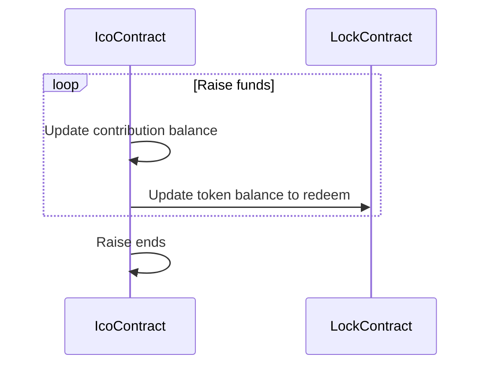
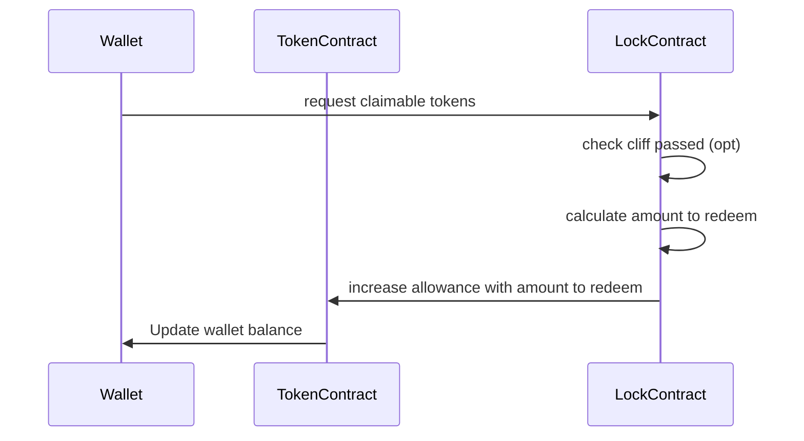

# ICO Project

## Technical Spec

<!-- Here you should list the technical requirements of the project. These should include the points given in the project spec, but will go beyond what is given in the spec because that was written by a non-technical client who leaves it up to you to fill in the spec's details -->

SPC Token

- have 500,000 max total supply
- 150,000 of supply will be allocated for ICO
- 350,000 of supply will be allocated to the treasury
- A 2% tax on every transfer that gets put into a treasury\* account
  - A flag that toggles this tax on/off, controllable by owner, initialized to false

SPC ICO

- The goal will be to raise 30,000 ETH
- ICO will have three phases: Seed, General and Open
- Exchange ration is 5 tokens to 1 Ether
- ETH contributions will be kept in the SPC ICO contract
- Seed Phase
  - only be available to private investors added to the ICO's allowlist
  - maximum total private contribute limit is 15,000 ETH
  - individual contribution limit is 1,500 ETH
  - for every contribution, the amount of token will be stored for redemption in Open phase
- General Phase
  - it will be available to every user (not only whitelisted)
  - maximum total private contribute limit is 30,000 ETH
  - individual contribution limit is 1,000 ETH
  - if a user already contributed in Seed phase
    - if it was **under** the General phase limit, it can contribute for the difference between current personal limit and what already invested in Seed phase
    - if it was **above** the General phase limit, no contribution can be made
  - for every contribution, the amount of token will be stored for redemption in Open phase
- Open Phase
  - it will be available to every user (not only whitelisted)
  - maximum total private contribute limit is 30,000 ETH
  - there is not and individual contribution anymore
  - users can claim the tokens gained in Seed/General Phase
  - every contributions will now distribute SPC tokens
    - SPC tokens won't be stored for redemption anymore
- Owner acions
  - owner can pause/resume the ICO at any time
  - owner can move a phase forward (but not backwards) at any will

## Design Exercise Answer

<!-- Answer the Design Exercise. -->
<!-- In your answer: (1) Consider the tradeoffs of your design, and (2) provide some pseudocode, or a diagram, to illustrate how one would get started. -->

> The base requirements give contributors their SPC tokens immediately. How would you design your contract to vest the awarded tokens instead, i.e. award tokens to users over time, linearly?

A) Probably one of the simpliest method is to create a Lock Smart Contract (ie LockContract).

Anytime a user make a contribution or whatever action to increase the reedemable tokens, the Ico contract will update the balance on the LockContract
timelock smart contract.

Lock contract will define in how many periods the claim will be available and how many tokens the user can claim will.
After Ico is complete and the user can claim them, it will call the LockContract instead of the Ico contract.
Ico Contract performs the checks, increase allowance by the amount it can receive (using TokenContract) and call TokenContract to update the user balance

Tradeoff: there is no concept of owner in the LockContract, so if the user cannot sign the transaction funds are lost

On this I prefer to use a diagram instead of psuedo code





B) Another option could be implementing Vaults (or Lockboxes) contracts. It's similar to the first one (probably simplier) but different on how logic is implemented
Basically, when the Ico reached the goal/is complete, the owner (or via an external service that will call the blockchain with its private keys)
will distribute tokens in these Vaults (an array).

Every one of them will have:

- address beneficiary (the user that will claim them)
- uint claimableFrom
- uint claimableBalance (or just balance, kept claimable for consistency)

```solidity

contract TokenVestVault {
  IERC20 token;

  struct Vault {
    beneficiary
    claimableFrom
    claimableBalance
  }

  Vaults[] public vaults

  constructor(address _token) {
    token IERC20  = _token;
  }

  function deposit(beneficiary, amount, claimableFrom) returns(something) {
    token.transferFrom(msg.sender, address, amount)
    Vault v = ({
      beneficiary
      claimableFrom
      claimableBalance
    })
    vaults.push(v)
    return something
  }

  function claimTokens(vaultIndex) returns(something) {
    Vault v = vaults[vaultIndex]

    check msg.sender == v.beneficiary
    check claimableFrom with current time

    amount = v.balance
    v.balance = 0

    token.transfer(msg.sender, amount)

    return something
  }
}
```

## Testnet Deploy Information

| Contract     | Address Etherscan Link                                                                                                        |
| ------------ | ----------------------------------------------------------------------------------------------------------------------------- |
| SpaceCoin    | [0x4F64CD8321a178B9C9812bdFA26974897F3A40D6](https://rinkeby.etherscan.io/address/0x4F64CD8321a178B9C9812bdFA26974897F3A40D6) |
| SpaceCoinIco | [0xC0170028C651d66ff1bd7988aa10c232306a0BDD](https://rinkeby.etherscan.io/address/0xC0170028C651d66ff1bd7988aa10c232306a0BDD) |

## General notes

- Failure of ERC20 transfer was not done since it's using Openzeppelin contract
- Frontend code is not optimized 
- Contracts' artifacts for frontend were copy&pasted under `/frontend/src/contracts`
  - it could be automatized or have a different config to allow loading of resources outside `src` folder (Create react app constraint)
- Allowlist is only initialized on constructor
  - it could be more complex to manage since the deployer needs to know the addresses at deploy time, but I think it's just more suitable for the current specs

## Deployment notes
`check deploy.ts` if needed

- Token contract is deployed
- Ico contract is deployed
- Token contract will transfers the deployer's SpaceCoin Ico supply to SpaceCoinIco contract address
  ```javascript
  await spaceCoin.transfer(spaceCoinIco.address, spaceCoin.balanceOf(deployer.address));
  ```

## frontend

App will show how many SPC coins has been distributed (X of ICO_SUPPLY).

Investor

- contribute to the ICO
  - show error message if something wrong like
    - ICO paused
    - not within contribution limits
    - for generic like metamask errors, just a generic error
- show investor balances (claimable, tokens received, eth invested)
- claim tokens
  - show error if it's not in Open phase
- show error if press "Next phase" button
- show error if press "Pause"/"Resume" button
- refresh UI using Event listening (events emitted from contract)

Owner

- contribution has same logic/checks as a normal investor
- allow to advance phase
- pause / resume (need a page refresh)


### Run frontend
`Note for reviewer:`
if you want to use the frontend, start with seed phase and ping me for advancing phases (where you can contribute since there is no whitelisting method)`

ETH raised is already at 0.1 (a transaction test I've made), hf!

- go into /frontend folder
- add contract address in .env file (there it .env.example to check the variable names)

```shell

npm i

#run with contract on local env
npm start-local # you will need to update SpaceCoinIco.ts and SpaceCoin.ts with the contract address generated by hardhat/foundry

npm start # nothing to add

```

## Useful Commands

Try running some of the following commands:

```shell
npx hardhat help
npx hardhat compile              # compile your contracts
npx hardhat test                 # run your tests
npm run test                     # watch for test file changes and automatically run tests
npx hardhat coverage             # generate a test coverage report at coverage/index.html
REPORT_GAS=true npx hardhat test # run your tests and output gas usage metrics
npx hardhat node                 # spin up a fresh in-memory instance of the Ethereum blockchain
npx prettier '**/*.{json,sol,md}' --write # format your Solidity and TS files
```
